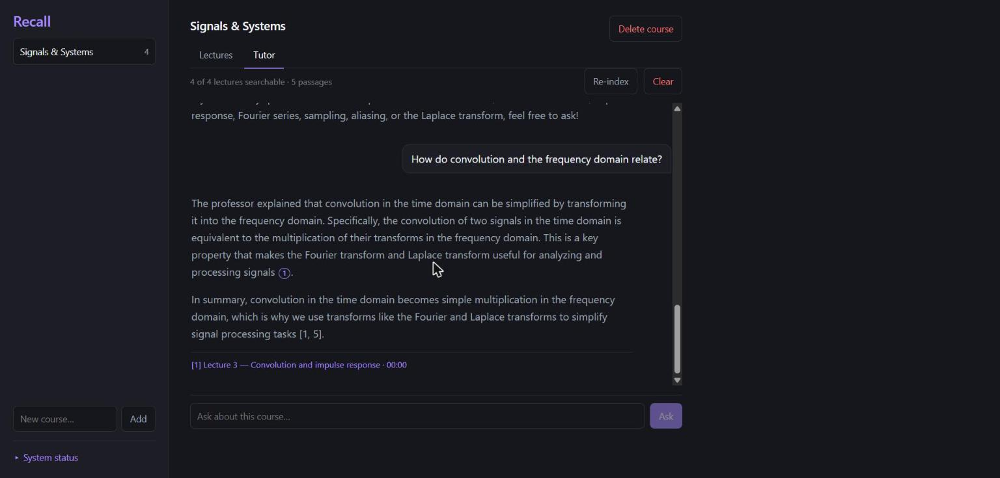
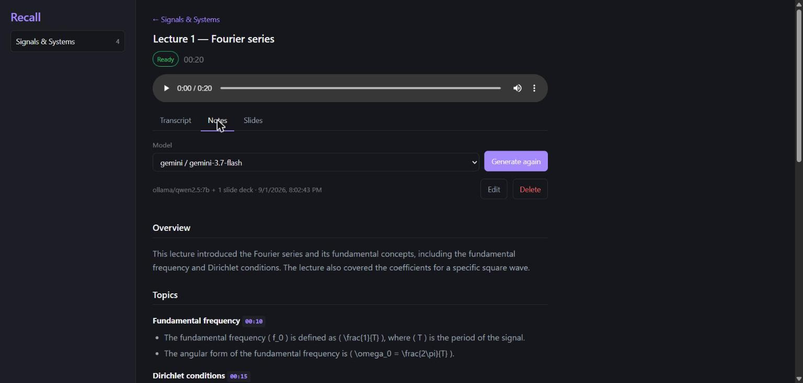
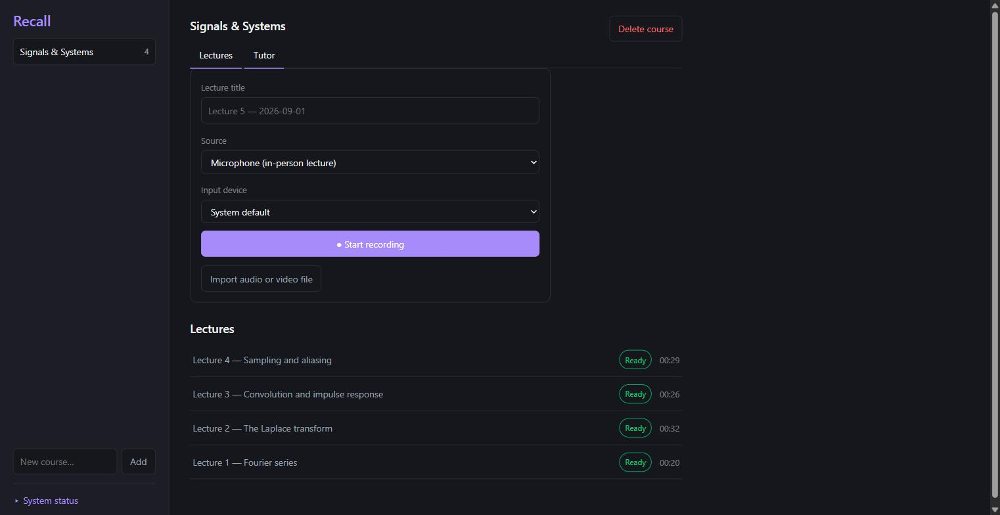

# Recall

**Record a lecture. Get it back when you need it.**

Recall records your lectures, transcribes them on your own GPU, and turns them
into study notes and a tutor that answers from what your lecturer actually said
— citing the lecture and the minute it came from, so you can jump straight to
the audio and hear it for yourself.

It runs entirely on your machine. Nothing is uploaded unless you choose a cloud
model, and even then the recordings never leave your disk.



## Why

Lecture notes fail in a specific way: three weeks later you remember that the
lecturer said something important about aliasing, but not which lecture, and
certainly not when. Recording solves the memory problem and creates a search
problem — nobody scrubs through eleven hours of audio.

Recall closes that loop. Every lecture becomes searchable text, and every answer
points back at the exact moment in the recording, so you can always check what
was really said rather than trusting a summary.

## What it does

**Record or import.** Capture from your microphone in a lecture hall, from tab
audio for an online lecture, or both mixed together for a hybrid class. Already
have a recording? Drop in any audio or video file and the audio is extracted.

**Transcribe locally.** Whisper (`faster-whisper`) runs on your GPU. No upload,
no per-minute cost, no length limit. You get a timestamped transcript with
click-to-seek playback and in-transcript search.

**Turn it into notes.** One click produces structured markdown — overview,
topics in the order taught, definitions, formulas, worked examples, exam hints,
and an explicit list of what the lecture *didn't* cover. Every heading carries a
`[MM:SS]` you can click to hear that moment.



**Feed it the slides.** Attach the lecturer's deck — **PDF or PowerPoint** —
and its text joins the transcript as source material. It fixes technical terms
speech recognition mangles and recovers what was shown rather than said, marked
"(from slides)" so you know which parts you won't hear in the audio.

PowerPoint files are read directly rather than converted, which also picks up
the **speaker notes** — often the most useful part of a deck, and the part a PDF
export throws away. Legacy `.ppt` is converted first, and needs PowerPoint or
LibreOffice installed; re-saving as `.pptx` avoids that.

**Ask the course.** The tutor searches every indexed lecture at once and answers
with citations. Ask "what did she say about the region of convergence?" and get
an answer plus a link to Lecture 2 at 04:15.



## Local or cloud, per task

Every AI task is routed independently in `config.yaml`:

| Task | What it does | Default |
| --- | --- | --- |
| `summarize` | Study notes for a lecture | A frontier model — see below |
| `chat` | The course tutor | `ollama` / `qwen2.5:7b` — needs no API key |
| `embeddings` | Search index | `ollama` / `nomic-embed-text` — local and free |
| `quiz` | Quizzes and flashcards *(M5, not built yet)* | `ollama` / `qwen2.5:7b` |

Providers: `ollama` (local), `gemini`, `claude`, and any OpenAI-compatible
endpoint. Switching a task between them is a two-line edit to `config.yaml` —
no code changes — and the whole app works offline with Ollama alone.

**On note quality:** a 7B local model will confidently write out the standard
textbook treatment of a topic the lecturer only mentioned in passing. Prompt
work reduced this a lot but did not eliminate it. For notes, prefer Gemini
(generous free tier) or Claude, and check anything surprising against the
transcript — that is what the timestamps are for. Retrieval-grounded answering
is a different matter: handed the actual passages, the local model held up well,
which is why the tutor defaults to it.

## Requirements

- Python 3.13+, Node 20+, and **ffmpeg on PATH**
- An NVIDIA GPU is strongly recommended. Without one, transcription falls back
  to CPU and is much slower.
- [Ollama](https://ollama.com) for the free local path:
  `ollama pull qwen2.5:7b` and `ollama pull nomic-embed-text`

Built and tested on Windows 11 with an RTX 4060 (8 GB).

## Setup

```powershell
# Backend
cd backend
python -m venv .venv
.venv\Scripts\pip install -e .

# Frontend
cd ..\frontend
npm install
```

Then create `.env` in the repo root with any cloud keys you want (see
[Configuration](#configuration)). You can skip it entirely and stay local.

## Running

Two terminals:

```powershell
cd backend; .venv\Scripts\python -m uvicorn app.main:app --reload --port 8000
```

```powershell
cd frontend; npm run dev
```

Open <http://localhost:5173>. Add a course, then record or import a lecture —
transcription and indexing start on their own. "System status" in the sidebar
shows GPU, ffmpeg and provider health.

Browser recording needs a secure context. `localhost` qualifies; reaching the
dev server over LAN by IP does not, so recording from a phone needs HTTPS or
Chrome's "Insecure origins treated as secure" flag.

## Access and security

**There is no authentication.** Anyone who can reach the ports can read every
recording, transcript and note. That is a deliberate trade for a single-user
local app, but where you bind matters:

- The backend binds `127.0.0.1` unless you pass `--host`.
- The Vite dev server binds **all interfaces** so you can open the app from your
  phone — which also means anyone on the same Wi-Fi can, and it proxies straight
  through to the backend.

Fine at home. On university or public Wi-Fi it means classmates can browse your
lectures. To keep it to this machine, set `host: false` in `vite.config.ts` or
run `npm run dev -- --host 127.0.0.1`.

Recording lectures may need your lecturer's or institution's permission. That
part is on you, not the software.

## Configuration

`config.yaml` holds task routing and the transcription model/device.
`tasks.summarize.compare_with` lists extra provider/model pairs the Notes tab
offers beside the default, so you can summarise the same lecture twice and
compare before committing to one.

API keys go in `.env` at the repo root, which is gitignored and must never be
committed. Create it yourself and set only what you use:

```ini
# Anthropic — for tasks routed to provider: claude
ANTHROPIC_API_KEY=

# Google Gemini — free tier; key from https://aistudio.google.com/apikey
GEMINI_API_KEY=

# Any OpenAI-compatible endpoint (OpenAI, Groq, Together, OpenRouter, ...)
OPENAI_API_KEY=
OPENAI_BASE_URL=https://api.openai.com/v1

# Local Ollama. 127.0.0.1, not localhost: Ollama binds IPv4 only and on
# Windows localhost tries IPv6 first, costing a timeout on every call.
OLLAMA_BASE_URL=http://127.0.0.1:11434

# Optional: send all data (database, audio, slides) somewhere else.
# Tests set this so they never touch real recordings.
RECALL_DATA_DIR=
```

There is deliberately no `.env.example`. A committed template beside the real
file is easy to paste a key into by mistake, and that mistake is one
`git add -A` away from a public repository.

## How it works

```
Browser (React + TypeScript)
         │  /api
FastAPI ─┼─ routers/    thin HTTP layer
         ├─ services/   transcribe · notes · slides · index · tutor
         │              providers/  claude · gemini · openai · ollama
         └─ SQLite      metadata, transcripts, notes, vectors
                        audio and PDFs on disk, referenced by path
```

Slow work runs on background workers in two lanes — `gpu` for transcription
(serialised, since the card holds one Whisper model) and `llm` for
summarisation — so a request never blocks on a model.

Retrieval stores embeddings as raw float32 in SQLite and searches them with a
brute-force dot product in numpy. A semester is a few thousand chunks, where
that is sub-millisecond; a vector index would add a dependency and buy nothing
until roughly 100k. Sources are numbered before the model sees them and it cites
by number, so a citation can never name a lecture that does not exist.

Full detail in [docs/SPEC.md](docs/SPEC.md); milestone history in
[docs/ROADMAP.md](docs/ROADMAP.md).

## Status

M0–M4 are done: recording, transcription, notes, slides, and the tutor. M5 —
quizzes, flashcards, and web search for the tutor — is next.

Known limitations, kept honest:

- Retrieval is pure vector similarity, so a question phrased in words the
  lecturer never used may miss. Hybrid keyword + vector search is the fix.
- Local 7B notes need checking against the transcript, as above.
- No speaker labels — you cannot yet tell the lecturer from a student question.
- Changing `tasks.embeddings` invalidates every stored vector, since vectors
  from different models are not comparable. Hit Re-index on each course after.

## Good to know

- Whisper downloads its model from Hugging Face on first transcription (~1.5 GB
  for `distil-large-v3`), so the first run looks slow.
- CUDA needs cuBLAS and cuDNN 9 at runtime. They arrive as the
  `nvidia-cublas-cu12` / `nvidia-cudnn-cu12` dependencies, and
  `services/transcribe.py` puts their DLL folders on the search path at import,
  so no system PATH edits are needed. `Library cublas64_12.dll is not found`
  means those wheels are missing.
- Everything lives under `data/` and is never committed. It persists across
  restarts; nothing deletes it on its own.
- Deleting a lecture or course moves its audio and text to `data/.trash/`, one
  timestamped folder per lecture with a `lecture.json` holding the title,
  transcript and notes. Nothing ever empties it — that is your call.

## Licence

MIT — see [LICENSE](LICENSE).
